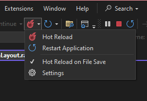

# Blazor Server Spike

## Hot Reloads

You can manually trigger a Hot Reload in Visual Studio or enable *Hot Reload on File Save*.



## `@code` Blocks or Code-behind

You can do either.

## RZ10012 Issues

I'm getting incorrect compiler warnings whenever I reference a `razor` component from another (e.g. child component).

## BUnit Testing with AuthorizeView in Component

You may get the following error if the component under test contains an `AuthorizeView` component:

> Authorization requires a cascading parameter of type Task<AuthenticationState>. Consider using CascadingAuthenticationState to supply this

rendered `AuthorizeView`s require a wrapping `CascadingAuthenticationState`, which would normally come from `App.razor`. More investigation is required to test these scenarios using BUnit.

Example `CascadingAuthenticationState` use:

```
<CascadingAuthenticationState>
    <AuthorizeView Policy="TwoFactorEnabled">
        <h1>Hello, @context.User.Identity.Name!</h1>
        <p>You can only see this content if you're authenticated.</p>
    </AuthorizeView>
</CascadingAuthenticationState>
```

You will likely want to inject a `Bunit.TestDoubles.FakeAuthorizationPolicyProvider` into the test services collection as well:

```
IAuthorizationPolicyProvider authPolicyProvider = new FakeAuthorizationPolicyProvider();
Services.AddSingleton(authPolicyProvider);
```

> note that this `Services` registration is for the `Bunit.TestContext` test class.

# TODO

- view model "dirty" checks
- view model validation and screen decoration
- testing with "AuthorizeView"